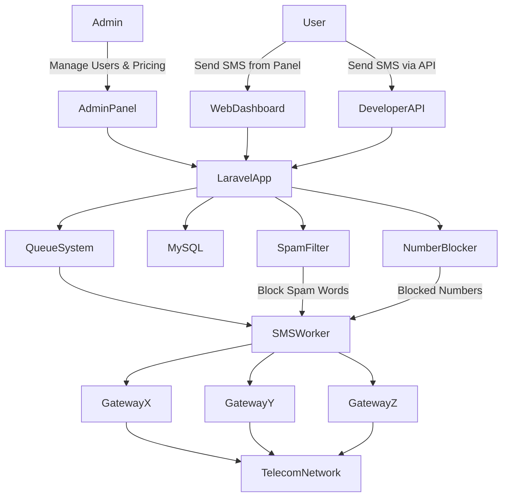

# SMS Reseller Platform with Multi-Gateway API Integration

A scalable **SMS reseller platform** that allows administrators to purchase SMS from multiple SMS providers and resell them to customers through a centralized dashboard.

Users can send SMS directly from the panel, upload Excel files for dynamic bulk messaging, manage phonebooks, and integrate SMS functionality into their own applications via API.

---

## Features

### Multi SMS Gateway Integration
- Connect multiple SMS providers
- Route SMS via selected gateway
- Flexible SMS purchasing

---

### SMS Reseller System
- Custom SMS pricing
- Customer management
- Balance tracking
- Profit monitoring

---

### SMS Web Panel
- Single SMS
- Bulk SMS
- SMS scheduling
- Unicode SMS
- Delivery reports

---

### Excel Dynamic SMS
Upload Excel files to send personalized SMS messages.

Example:

| Name | Phone | Message |
|-----|------|------|
| Rahim | 88017xxxx | Hello Rahim |

---

### Phonebook System
- Create contact groups
- Import contacts
- Send SMS to groups

---

### Developer API

Send SMS from external systems using REST API.

Example:
 - https://msg.example.com/api/sms-send

Parameters:

- api_token
- sender_id
- numbers
- message

---

### Security System

#### Spam Word Detection
Block messages containing restricted keywords.

#### Phone Number Blocking
Prevent sending SMS to blocked numbers.

---

### Analytics Dashboard
- SMS sent statistics
- Revenue tracking
- Customer activity
- Monthly reports

---

## Tech Stack

Backend:
- Laravel
- PHP

Database:
- MySQL

Messaging:
- Multi SMS Gateway API

Other:
- REST API
- Queue System

---

## Future Improvements

- WhatsApp messaging integration
- AI spam detection
- Advanced analytics dashboard

---

# 🏗 System Architecture

---

## Author

Md Atikur Rahman  
Full Stack Web Developer

GitHub: https://github.com/atikurrahman1587

LinkedIn: https://www.linkedin.com/in/atikurrahman1587
